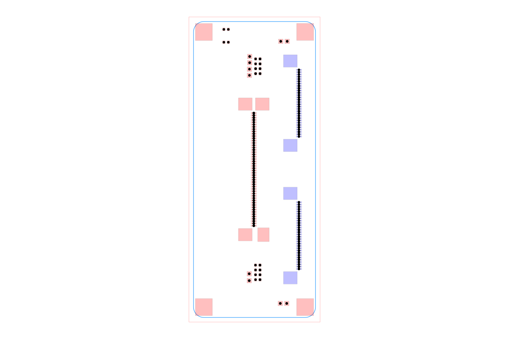

# dataset-srj24

Simple Route JSON dataset generated from ten production-oriented KiCad boards.
Every source is pinned to an immutable commit, redistributed under Apache-2.0,
and retained byte-for-byte in `kicad_pcb/`.

The selection excludes testbeds, simulation boards, ICT fixtures, archived
projects, and repositories described upstream as experimental. The designs are
complete hardware projects intended for their documented functional use. This
dataset validates source integrity and conversion, but it is not an independent
electrical-safety or manufacturing certification.

## Example

The image below shows `sample010`, the dual I-PEX CSI interposer. It is
generated by constructing an `AutoroutingPipelineSolver`, calling
`.visualize()`, and converting the returned graphics object to SVG with
`graphics-debug`.



Regenerate it with `bun run generate:readme-image`. Run `bun run cosmos` to
browse the representative sample. `bun run build:site` exports the static
Cosmos catalog to `cosmos-export/` for Vercel.

## Board summary

| Sample | Board | Complexity | Copper layers | Components | Pads | Traces | Vias | SRJ connections |
| --- | --- | --- | ---: | ---: | ---: | ---: | ---: | ---: |
| `sample001` | Jetson Nano Baseboard | Very high | 8 | 391 | 1,516 | 1,759 | 794 | 828 |
| `sample002` | HDMI to MIPI CSI-2 Bridge | High | 4 | 121 | 498 | 513 | 312 | 250 |
| `sample003` | SDI to MIPI CSI-2 Bridge | High | 6 | 190 | 638 | 706 | 374 | 321 |
| `sample004` | Thunderbolt to PCIe Adapter | High | 6 | 272 | 1,111 | 1,088 | 833 | 462 |
| `sample005` | M.2 to PCIe x4 Adapter | Medium | 4 | 20 | 163 | 157 | 92 | 93 |
| `sample006` | CM4 Baseboard LVDS Adapter | High | 6 | 155 | 519 | 545 | 254 | 248 |
| `sample007` | PMOD I3C Sensor Board | Medium | 4 | 96 | 233 | 284 | 71 | 96 |
| `sample008` | D1600E PSU Breakout Board | High | 4 | 237 | 727 | 525 | 903 | 288 |
| `sample009` | M.2 to OCuLink Adapter | Low | 4 | 25 | 150 | 173 | 183 | 91 |
| `sample010` | Dual I-PEX CSI Interposer | Low | 4 | 29 | 152 | 131 | 107 | 96 |

## Board descriptions and properties

### `sample001` — Jetson Nano Baseboard

Production-capable carrier for NVIDIA Jetson Nano, Xavier NX, and TX2 NX
modules. This is the intentionally high-complexity sample, with eight copper
layers and 828 routing connections.

Properties: Jetson SO-DIMM connector, Gigabit Ethernet, USB-C host, Micro USB
debug, Micro HDMI, Mini DisplayPort, M.2 Key M PCIe x4, two 50-pin MIPI CSI-2
FFC connectors, and a 6–36 VDC input.

[Pinned KiCad source](https://github.com/antmicro/jetson-nano-baseboard/blob/d8d0b2d71ab4cc4bcdb204a09f78be40d4c8cda3/jetson-nano-baseboard.kicad_pcb)

### `sample002` — HDMI to MIPI CSI-2 Bridge

Dual-channel video bridge that converts two HDMI streams to independent
four-lane MIPI CSI-2 outputs.

Properties: two HDMI inputs, two four-lane MIPI CSI-2 outputs, Toshiba
TC358743XBG bridge ICs, and Antmicro's 50-pin FFC host interface.

[Pinned KiCad source](https://github.com/antmicro/hdmi-mipi-bridge/blob/6c683289a3191ee6c92cf4f9065ca9b6cb2c0784/antmicro-hdmi-mipi-bridge-hw.kicad_pcb)

### `sample003` — SDI to MIPI CSI-2 Bridge

3G-SDI video bridge with loopback, FPGA-based conversion, dual MIPI CSI-2
outputs, and audio extraction.

Properties: 3G-SDI input and loopback output, two four-lane MIPI CSI-2 outputs,
Semtech GS2971A deserializer, Lattice CrossLink FPGA, and eight-channel I2S
audio output.

[Pinned KiCad source](https://github.com/antmicro/sdi-mipi-bridge-hw/blob/0d08a865eba70ac02bfe16601bbf6d719d5c9d41/sdi-mipi-bridge.kicad_pcb)

### `sample004` — Thunderbolt to PCIe Adapter

Thunderbolt 3 adapter that exposes a PCIe Gen3 x4 expansion slot and supplies
the 12 V rail required by add-in cards.

Properties: Intel JHL6340 Thunderbolt 3 controller, PCIe Gen3 x4 slot, and an
on-board 12 V step-up converter.

[Pinned KiCad source](https://github.com/antmicro/thunderbolt-pcie-adapter/blob/0ae5bbe967dff2b973bcf84522a081cee28a156c/thunderbolt-pcie-adapter.kicad_pcb)

### `sample005` — M.2 to PCIe x4 Adapter

Passive adapter routing an M.2 Key M PCIe x4 interface to a standard PCIe x4
card socket.

Properties: M.2 Key M edge connector, PCIe x4 card socket, external power
connector, and a 0.8 mm target PCB thickness.

[Pinned KiCad source](https://github.com/antmicro/m2-pcie-adapter/blob/11844f18ce14393043affde9e7aa8d51c0cd3ba7/m2-pcie-adapter.kicad_pcb)

### `sample006` — CM4 Baseboard LVDS Adapter

Display adapter converting MIPI DSI from Antmicro's CM4 baseboard to LVDS while
powering an LCD panel and its backlight.

Properties: TI SN65DSI84 MIPI DSI-to-LVDS bridge, I2C touchscreen interface,
18 V, 9.6 V, 3.9 V, and 3.3 V display rails, and an integrated backlight
driver.

[Pinned KiCad source](https://github.com/antmicro/cm4-baseboard-lvds-adapter/blob/4af945ed558e58e4b8aea6fe909fc33d78b63f6f/cm4-lvds-adapter.kicad_pcb)

### `sample007` — PMOD I3C Sensor Board

PMOD-compatible sensor module combining temperature, magnetic, and acceleration
sensing on a shared I3C bus.

Properties: P3T1755 temperature sensor, MMC5603NJ three-axis magnetometer,
BMA580 three-axis accelerometer, I2C/I3C support, and two configurable
push-pull or open-drain output stages.

[Pinned KiCad source](https://github.com/antmicro/pmod-i3c-sensor-board/blob/5ee5d34ff918422fe7af59f7ffdc9d4bdabf18a7/pmod-i3c-sensor-board.kicad_pcb)

### `sample008` — D1600E PSU Breakout Board

Managed breakout for a Dell D1600E-S0 supply with five independently measured
and switched 12 V outputs.

Properties: five output channels, up to 220 W per output, Hall-effect current
sensing with a 12-bit ADC, I2C GPIO power switching, and opto-isolated FT4232H
USB control.

[Pinned KiCad source](https://github.com/antmicro/d1600e-psu-breakout/blob/3802831dcd6c9c6e278216771e92ca7fe3f9ae41/d1600e-psu-breakout-board.kicad_pcb)

### `sample009` — M.2 to OCuLink Adapter

Passive adapter carrying four PCIe lanes from an M.2 Key M socket to an OCuLink
cable interface.

Properties: M.2 Key M edge connector, OCuLink PCIe x4 connector, support for
2280, 2260, and 2242 mechanical formats, and Jetson Orin Baseboard
compatibility.

[Pinned KiCad source](https://github.com/antmicro/m2-oculink-adapter/blob/067f60727046cd0c0db1d39c51c9396f89f48b65/antmicro-m2-oculink-adapter-hw.kicad_pcb)

### `sample010` — Dual I-PEX CSI Interposer

Two-to-one camera interposer joining a pair of four-lane I-PEX MIPI CSI-2 links
to Antmicro's 50-pin FFC host interface.

Properties: two 30-pin I-PEX camera connectors, four MIPI CSI-2 lanes per
camera, one 50-pin host FFC connector, and I2C plus camera-power pass-through.

[Pinned KiCad source](https://github.com/antmicro/dual-ipex-csi-interposer/blob/6b6bd0af5aafe13c02377d534a23a6373922f350/dual-ipex-csi-interposer.kicad_pcb)

## Repository structure

- `kicad_pcb/` contains the exact upstream KiCad boards.
- `circuit-json/` contains converter output for each board.
- `samples/` contains Simple Route JSON with existing top-level routing removed.
- `source-files.json` records immutable provenance, license links, descriptions,
  features, statistics, converter warnings, compatibility normalizations, and
  any unambiguous missing-port repairs.
- `src/` and `index.html` provide the same local viewer structure as
  `dataset-srj18`.

Compatibility normalization is applied only to the in-memory conversion input.
It removes unsupported graphic UUIDs or routing-state fields that do not affect
the unrouted SRJ problem. Missing PCB ports are repaired only when a connected
source port has exactly one pad or plated-hole candidate with the matching pin
hint. The checked-in `.kicad_pcb` files are never rewritten.

## Licensing

Original code and documentation in this repository are licensed under the MIT
License unless otherwise stated. The unmodified boards in `kicad_pcb/` and the
generated board data in `circuit-json/` and `samples/` remain under Apache-2.0;
the repository-level MIT license does not relicense those materials. The full
policy is in `LICENSE`, the Apache-2.0 text is in
`LICENSES/Apache-2.0.txt`, and immutable source attribution is in
`THIRD_PARTY_NOTICES.md` and `source-files.json`. None of the pinned upstream
revisions contains a root `NOTICE` file.

## Usage

```js
const { sample001, dataset } = require("@tscircuit/dataset-srj24")
```

## Regenerate and validate

```sh
bun install
bun run generate
bun run test
bun run build
```

The generator downloads each pinned `.kicad_pcb`, converts it to Circuit JSON
with `kicad-to-circuit-json`, and converts that output to Simple Route JSON with
`getSimpleRouteJsonFromCircuitJson` from `@tscircuit/core`.
